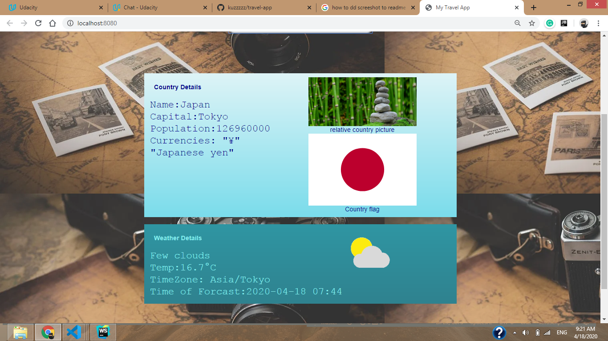
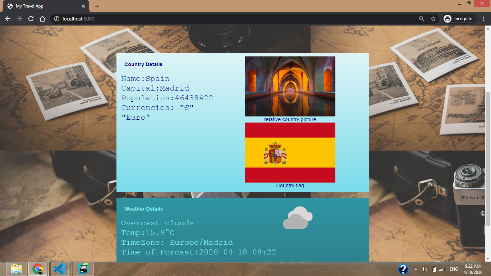

# Udacity Front End Nanodegree Capstone Project

## A Travel Booking App
This project is an app that takes a desired location from a user and displays the weather and an image of the location using information obtained from external APIs. It also displays some facts about the trip destination like the currency and flag.

The project makes use of tecnologies such as HTML, CSS, SASS, JavaScript, Node.js, Express.js, API, Webpack, Babel, and Jest


Node and express are the webserver and routing, and webpack is the build tool of choice. Using webpack, I set up the app to have dev and prod environments, each with their own set of tools and commands.

## Project Requirements
- Webpack config should contain at least 3 scripts, express server, build and test. Additionally, dev server may be included.
- There should be at least one test for the express server and application javascript.
- The project must have service workers installed.
- All features are usable across modern desktop, tablet, and phone browsers.
- Styling is set up in a logical way. All interactive elements have hover states.
- HTML structure should be indented properly with classes and ID’s that make sense.
- There should be URLS and API Keys for at least 3 APIs, including Geonames, Weatherbit, and Pixabay. You can feel free to use more than 3 APIs.
- There should be a primary object with placeholder member value pairs.
- There should be a primary function that is exported to index.js.

## Project Suggestions That Were Implemented
- Pull in an image for the country from Pixabay API when the entered location brings up no results (good for obscure localities).
- Integrate the REST Countries API to pull in data for the country being visited.
- Incorporate icons into forecast.

## Get Up and Running

Fork this repo, then clone the branch of your choice from your forked repo down to your computer:

```
git clone -- git@github.com:[your-user-name]/webpack-express.git --
```

`cd` into your new folder and run:
- ```npm install```

and 
- ```npm start```
 run the local server

## Screanshoot
here are some screenshots of the working app 
Format: 
Format: 


## Run In Development
- Run npm run build-dev
## Run In Production
- Run npm run build-prod
Visit localhost:8080 on your browser
## Testing
Jest is the tool of choice for running tests on the app. To test, run npm test in the terminal.

## API
The this project uses the following APi
- Geonames
- Weatherbit
- Pixabay
- REST Countries
